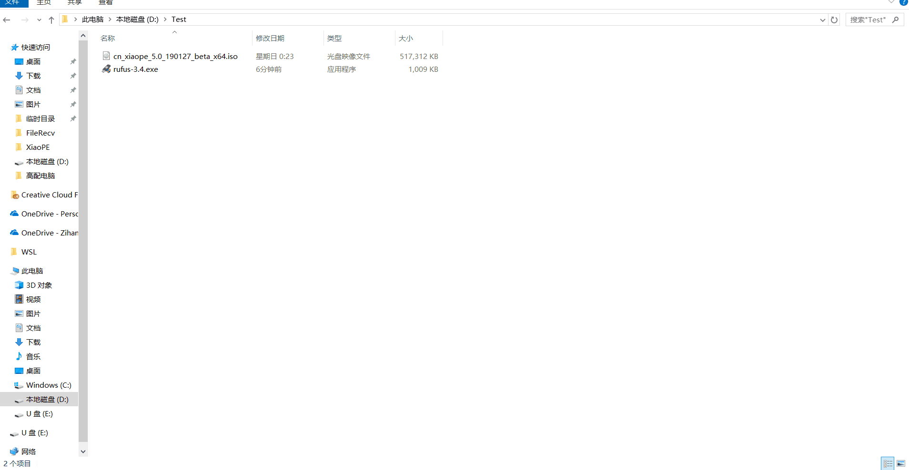

# 写入 XiaoPE
在本章，将会带领你从下载 XiaoPE 开始，将 XiaoPE 写入到你的 U盘 中，并让电脑从 U盘 中启动。
你需要准备：   
* 一台电脑
* XiaoPE 镜像（你可以在 [XiaoPE Download](d.xiaope.net)下载，建议下载最新版本。）
* Rufus（你可以在[Rufus 官网](https://rufus.ie/)下载到它的最新版本）
* 10-15分钟   
写入教程：

写入完成后，请使用[百度](https://nbhbdm.cn/?s=%E7%94%B5%E8%84%91U%E7%9B%98%E5%90%AF%E5%8A%A8%E7%83%AD%E9%94%AE)查询主板/笔记本的开机热键。并在开机时插入U盘，并按住启动热键，选择U盘进行启动。   
启动成功后，你应看到：

（XiaoPE 6.1.0及以上版本需要进行“初始化XiaoPE”操作。双击桌面上的“初始化XiaoPE”即可。）   
如果在启动时出现蓝屏，原因可能如下：   
* 你的电脑内存在 2G 以下，不支持使用 XiaoPE.   
* 你的电脑配置较老，硬件不支持 XiaoPE.   
！如果你的电脑为UEFI启动，建议先使用Bootice修复UEFI引导再进行使用，以免XiaoPE因缺失引导而无法启动。   