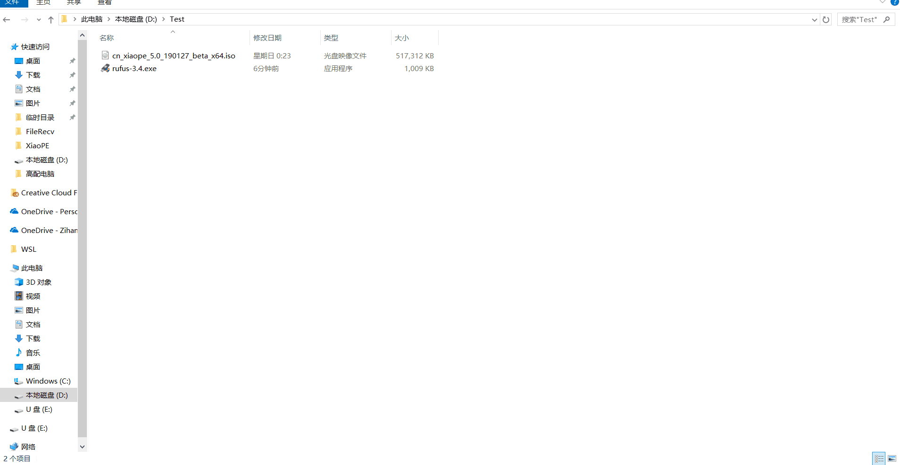

# 写入 XiaoPE
在本章，将会带领你从下载 XiaoPE 开始，将 XiaoPE 写入到你的 U盘 中，并让电脑从 U盘 中启动。
你需要准备：   
* 一台电脑
* XiaoPE 镜像（你可以在 [XiaoPE Download](d.xiaope.cn)下载，建议下载最新版本。）
* Rufus（你可以在[Rufus 官网](https://rufus.ie/)下载到它的最新版本）
* 10-15分钟   
写入教程：
